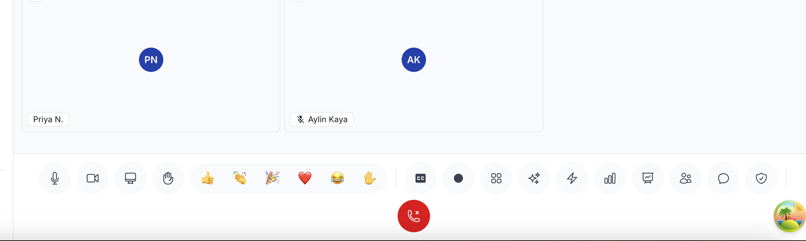

# `/impeccable` — Frontend Tasarım Skill'i

`/impeccable`, üretim kalitesinde frontend arayüzleri tasarlamak ve iyileştirmek için
kullanılan bir skill'dir. Prototip değil, **gerçek çalışan, sevk edilebilir kod** üretir.
Web siteleri, landing page'ler, dashboard'lar, ürün arayüzleri, formlar, onboarding
akışları ve boş durumlar (empty states) gibi her türlü arayüzle ilgilenir.

Amacı: "AI yapmış" izlenimi vermeyen, marka kimliğine uygun, erişilebilir, hızlı,
responsive ve detayına özen gösterilmiş arayüzler ortaya koymak.

---

## Nasıl Çalıştırılır

```
/impeccable <komut> [hedef]
```

- **Argümansız** (`/impeccable`): "Ne yapmalıyım?" demektir. Projenin durumuna göre
  en değerli 2-3 komutu önerir, ardından tüm menüyü gösterir. Hiçbir komutu otomatik
  çalıştırmaz — öneri sunar, onayı sen verirsin.
- **İlk kelime bir komutsa**: O komutun referansı yüklenir ve uygulanır. Komuttan
  sonraki her şey "hedef" olarak alınır (örn. `/impeccable polish HeroSection`).
- **Komut yoksa ama niyet açıksa**: Örn. "boşlukları düzelt" → `layout`, "şu hata
  mesajını yeniden yaz" → `clarify` otomatik eşleşir.

---

## Komutlar

### 🛠️ Build (Kurma)
| Komut | Açıklama |
|---|---|
| `craft [özellik]` | Önce planla (shape), sonra özelliği baştan sona inşa et |
| `shape [özellik]` | Kod yazmadan önce UX/UI'ı planla |
| `init` | Proje bağlamını kur: PRODUCT.md, DESIGN.md, canlı config, sonraki adımlar |
| `document` | Mevcut proje kodundan DESIGN.md üret |
| `extract [hedef]` | Yeniden kullanılabilir token ve bileşenleri design system'e çek |

### 🔍 Evaluate (Değerlendirme)
| Komut | Açıklama |
|---|---|
| `critique [hedef]` | Heuristic skorlamayla UX tasarım incelemesi |
| `audit [hedef]` | Teknik kalite kontrolleri (a11y, performans, responsive) |

### ✨ Refine (İyileştirme)
| Komut | Açıklama |
|---|---|
| `polish [hedef]` | Sevkiyat öncesi son kalite turu |
| `bolder [hedef]` | Çekingen veya sönük tasarımları güçlendir |
| `quieter [hedef]` | Agresif veya aşırı uyarıcı tasarımları sakinleştir |
| `distill [hedef]` | Özüne indir, karmaşıklığı kaldır |
| `harden [hedef]` | Üretime hazır: hatalar, i18n, kenar durumlar |
| `onboard [hedef]` | İlk kullanım akışları, boş durumlar, aktivasyon tasarla |

### 🎨 Enhance (Zenginleştirme)
| Komut | Açıklama |
|---|---|
| `animate [hedef]` | Amaçlı animasyon ve hareket ekle |
| `colorize [hedef]` | Tek renkli arayüzlere stratejik renk ekle |
| `typeset [hedef]` | Tipografi hiyerarşisini ve fontları iyileştir |
| `layout [hedef]` | Boşluk, ritim ve görsel hiyerarşiyi düzelt |
| `delight [hedef]` | Kişilik ve akılda kalıcı dokunuşlar ekle |
| `overdrive [hedef]` | Geleneksel sınırların ötesine geç |

### 🔧 Fix (Düzeltme)
| Komut | Açıklama |
|---|---|
| `clarify [hedef]` | UX metinlerini, etiketleri ve hata mesajlarını iyileştir |
| `adapt [hedef]` | Farklı cihaz ve ekran boyutlarına uyarla |
| `optimize [hedef]` | UI performansını teşhis et ve düzelt |

### 🔁 Iterate (Yineleme)
| Komut | Açıklama |
|---|---|
| `live` | Görsel varyant modu: tarayıcıda eleman seç, alternatifler üret |

### ⚙️ Yönetim Komutları
| Komut | Açıklama |
|---|---|
| `pin <komut>` | `$<komut>` ile doğrudan kısayol oluştur (örn. `$polish`) |
| `unpin <komut>` | Kısayolu kaldır |
| `hooks <on\|off\|status\|...>` | UI dosyası düzenlemelerinden sonra çalışan tasarım dedektörü hook'unu yönet |

---

## Temel Tasarım Kuralları (Skill'in Uyguladığı)

- **Renk/Kontrast**: Gövde metni arka planla en az 4.5:1 kontrast tutmalı. Açık gri
  metin okunabilirliği bozar — en sık yapılan AI hatası.
- **Tipografi**: Gövde satır uzunluğu 65–75ch; display başlık üst sınırı ~6rem;
  harf aralığı zemini ≥ -0.04em.
- **Layout**: Kart'lar tembel çözümdür; iç içe kart asla kullanılmaz. 1D için flexbox,
  2D için grid. Semantik z-index ölçeği kullan (999/9999 değil).
- **Hareket**: Niyetli olmalı, sonradan eklenmiş gibi değil. Ease-out eğrileri;
  bounce/elastic yok. `prefers-reduced-motion` zorunlu.

## Kesin Yasaklar (Absolute Bans)
- Yan-şerit (side-stripe) border'lar
- Gradient metin (`background-clip: text` + gradient)
- Varsayılan glassmorphism
- Hero-metric şablonu (büyük sayı + küçük etiket + gradient)
- Aynı boyutta tekrarlanan ikon+başlık+metin kart gridleri
- Her bölümün üstünde küçük, büyük harfli, geniş aralıklı eyebrow
- Varsayılan numaralı bölüm işaretçileri (01 / 02 / 03)
- Kapsayıcısını taşıran metin

## "AI Slop" Testi
Biri arayüze bakıp tereddütsüz "bunu AI yapmış" diyebiliyorsa, tasarım başarısızdır.
Kategoriden palet/temayı tahmin edilebiliyorsa, ilk eğitim refleksine düşülmüştür —
yeniden çalışılır.
